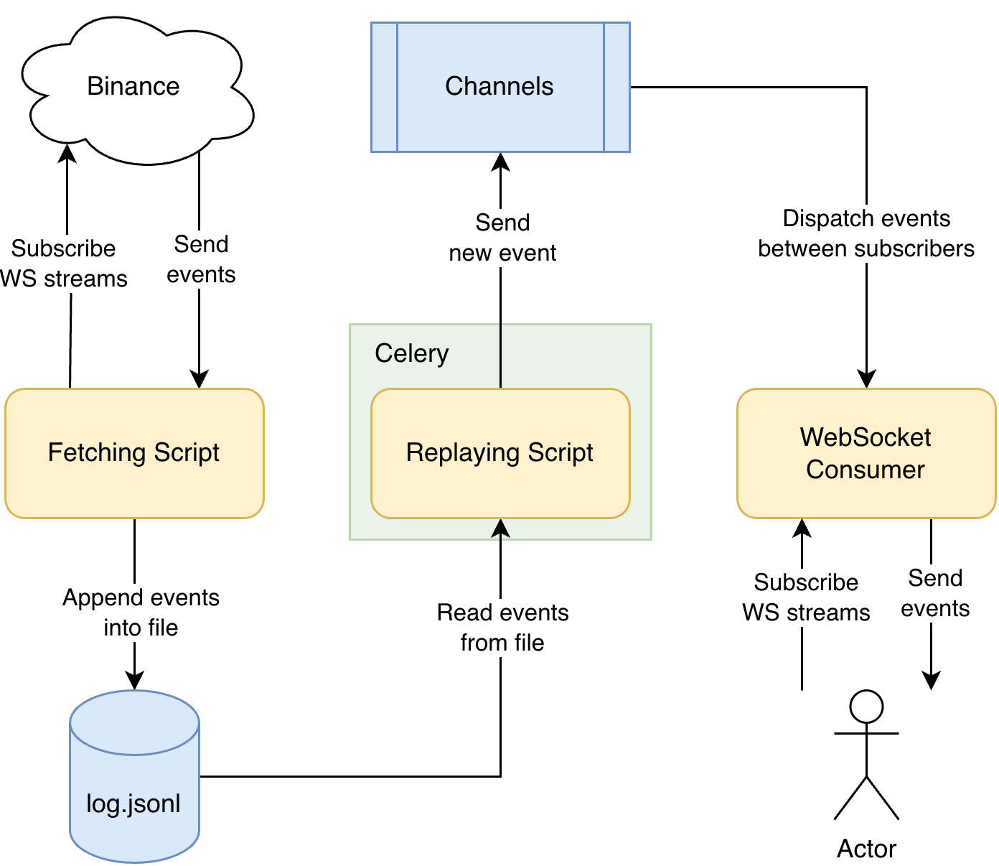

# Exchange

## 🏗️ Architecture & Technologies

The backend system is developed using Python with the Django framework, and it connects to the exchange through the
WebSocket protocol. Background tasks are carried out using Celery. WebSocket server is working on Django Channels over
Redis.

### 📚 Stack:

- [Python](https://python.org/) - project language
- [Pydantic](https://docs.pydantic.dev/latest/) - data validation library for parsing data returned by the exchange
- [Django](https://www.djangoproject.com/) - backend framework
- [Celery](https://docs.celeryq.dev/en/stable/) - background tasks library
- [Channels](https://channels.readthedocs.io/en/latest/) - ASGI library to handle WebSockets, chat protocols, IoT
  protocols, and more

## 📄 Documentation



1. Fetching script runs in a separate container, subscribes to Binance websocket and saves incoming events to a file for
   the time specified when running the script.
2. Celery runs a background task of the replaying script, which reads events from a file and sends them to channels,
   simulating delays between data, similar to the delays when subscribing to the original server.
3. Clients subscribe or unsubscribe to the WebSocket server and receive the appropriate data depending on their
   subscriptions.

### 📖 API Reference

#### WebSocket Stream

- Endpoint: `WS /stream/`
- Request structure:
  ```
  {
      "action": "subscribe" | "unsubscribe",
      "pair": "BTCUSDT" | "ETHUSDT" | "BNBUSDT",
      "stream": "trade" | "ticker" | "depth"
  }
  ```
- Response structure:
  ```
  {
    "action": "subscribe" | "unsubscribe",
    "subscription": "BTCUSDT-trade",
    "result": true
  }
  ```
- Event structure: [documentation](https://developers.binance.com/docs/binance-spot-api-docs/web-socket-api)
  ```json
  {
    "event": "trade",
    "event_time": 1725842832003,
    "symbol": "BTCUSDT",
    "price": 54718.1,
    "quantity": 0.006,
    "trade_time": 1725842832003,
    "market_marker": true,
    "ignore": null
  }
  ```

## 🛠 Getting Started

### 🔐 Setup Secrets

Copy and edit `.env` file with preferred values

```shell
cp deploy/config/.env.sample deploy/config/.env
source deploy/config/.env
```

### 🔧 Development Setup

#### 🗂 Setup Environment

Make sure your system has `poetry` and `python3.12` installed

```shell
poetry env use python3
poetry shell
poetry install
```

#### ⚙️ Start Services

Make sure your system has `docker` installed

```shell
docker compose -f deploy/docker-compose.yaml up -d redis
```

#### 🚀 Start API

```shell
./manage.py runserver 0.0.0.0:8000
```

### 💻 Production Setup

#### 🚀 Start Services

Make sure your system has `docker` installed

```shell
docker compose -f deploy/docker-compose.yaml up -d
```
